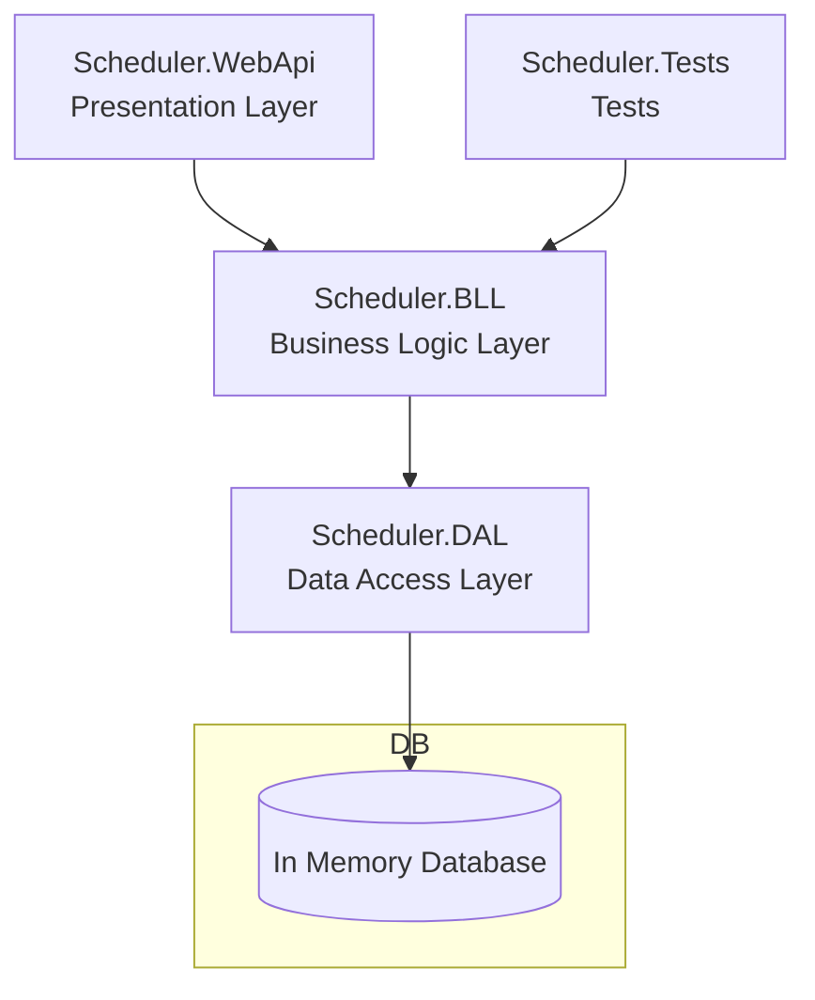

# 🔧 Scheduler Architecture

This is a learning project that aims to demonstrate the basic skills of creating a Web API. The project follows the classic **3-tier architecture**, which ensures a clear separation of concerns, scalability, and maintainability.

---

## Project Structure

| Layer            | Project Name   | Responsibility                                      |
|------------------|----------------|-----------------------------------------------------|
| **Presentation** | `Scheduler.WebApi`     | Web layer: controllers, and settings. |
| **Business Logic** | `Scheduler.BLL`       | Core logic: DTOs and services.    |
| **Data Access**  | `Scheduler.DAL`        | Database access: DbContext and In Memory Database. |
| **Tests**        | `Scheduler.Tests`      | Integration and Unit tests.                 |

---

## 🗂 Layer Overview

- `Scheduler.WebApi` – The entry point. Handles routing and controllers.
- `Scheduler.BLL` – Business logic: coordinates service operations and transforms data using DTOs.
- `Scheduler.DAL` – Data access logic using EF Core: includes entities and DbContext.
- `Scheduler.Tests` – Verifies real and mocking interactions with the in-memory database.

---

## 📐 Architecture Diagram



---

## 🔧 How to Run

1. 📦 **Install .NET 9 SDK**  
   👉 [Download .NET 9 SDK](https://dotnet.microsoft.com/en-us/download)

2. 📥 **Clone the repository**
   ```bash
   git clone https://github.com/serhiiyasenev/Scheduler.git
   cd Scheduler
   ```

3. 🧱 **Build the solution**
   ```bash
   dotnet build Scheduler.sln
   ```

4. 🧪 **Run the tests**
   ```bash
   dotnet test Scheduler.sln
   ```

5. 🚀 **Run the Web API**
   ```bash
   dotnet run --project Scheduler.WebApi
   ```

6. 🌐 **Open Swagger UI**  
   👉 [https://localhost:7272/index.html](https://localhost:7272/index.html)